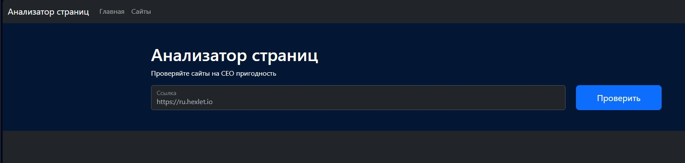
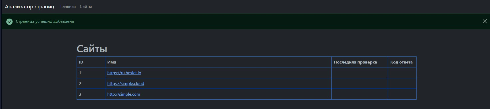
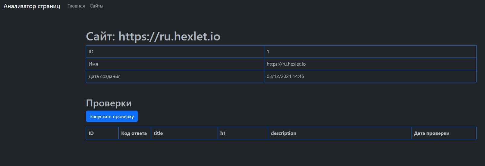
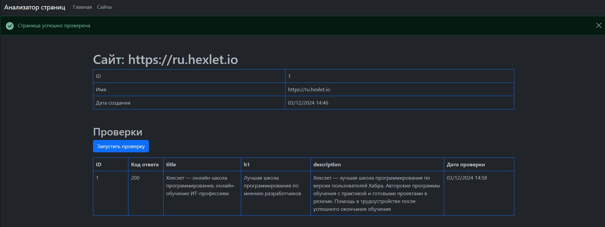
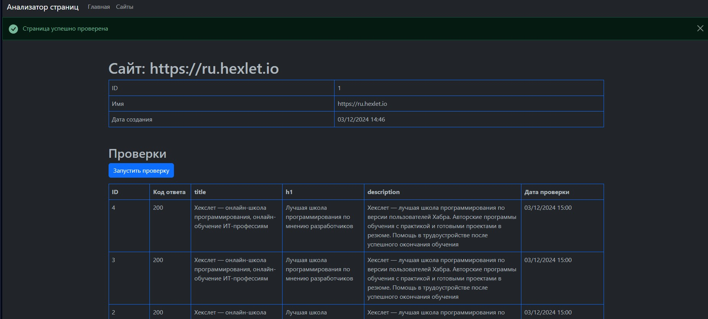

### Hexlet tests and linter status:

# Описание
[Анализатор страниц](https://java-project-72-vbkc.onrender.com) - полноценный веб-сайт на базе Javelin framework, который анализирует заданные страницы на предмет SEO-соответствия.

## Инструкция пользования
На главной странице добавляем сайт обязательно с использованием протокола http или https. Дальше нажимаем "Проверить":

Теперь мы видим все наши добавленные сайты. В таблицу можно добавлять сразу несколько сайтов:

Переходим по ссылке на интересующий сайт. Здесь мы видим общую информацию по сайту, а именно его id, имя и дату добавления:

Нажимаем на кнопку "Запустить проверку" и получаем всю необходимую информацию сайта: кода ответа, оглавление, заголовок 1 уровня, описание и дата запуска проверки:

Как и с таблицей сайтов, здесь можно делать несколько проверок в разные промежутки времени, результаты будут сохранены:

